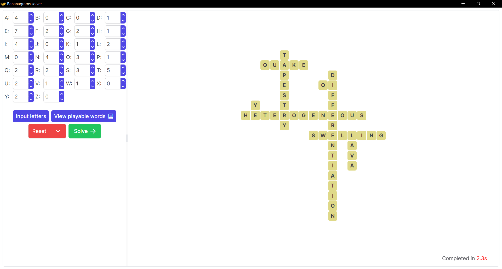
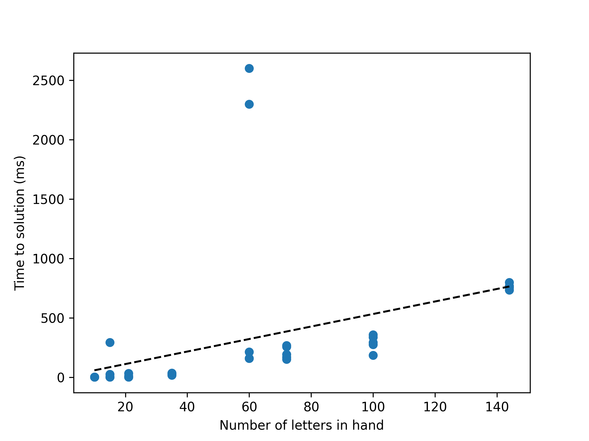
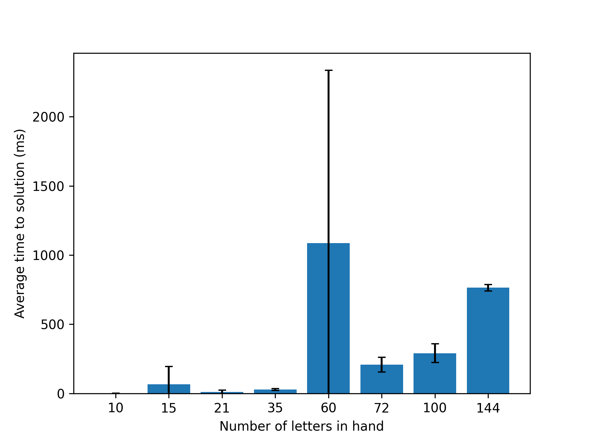
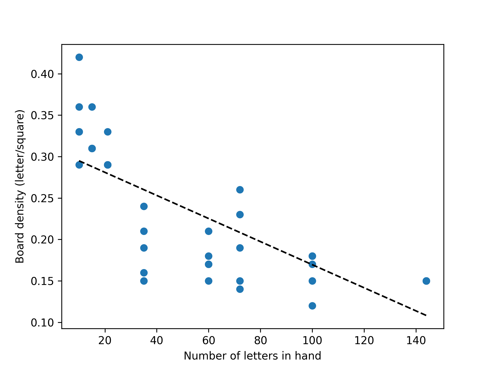
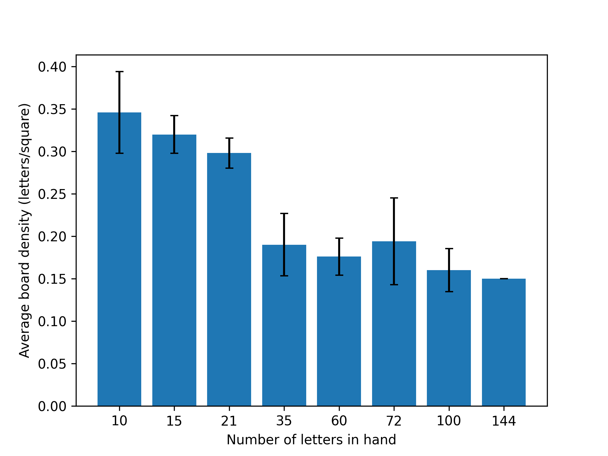

# Bananagrams solver

This is a standalone [Bananagrams](https://bananagrams.com/) solving program (not affiliated in any way with the official Bananagrams), complete with GUI. It was built using TypeScript React for the frontend and Tauri Rust for the backend.

The underlying algorithm has a few heuristics - it favors longer words and boards that alternate horizontally-vertically - but ultimately is exhaustive (if there is a solution, it will be found). It is generally very fast for smaller hands, and is still relatively performant for large hands. However, if there is no possible solution to a large hand processing can be slow (see [Performance](#performance)). Note that the solver is multithreaded and hence is not deterministic (i.e. multiple runs with the same hand can lead to different solutions).

*Example solution of a board using all 144 standard Bananagrams tiles - smaller boards are much faster*

## Usage
The simplest way to run is to download one of the prebuilt installers under the `Releases` section of GitHub. Alternatively, build from source:
### Setup
1. Install [Node.js](https://nodejs.org/en)
2. Install [Rust](https://www.rust-lang.org/)
3. In the repository directory, run `npm install`
### Running
Run `npm run tauri dev` to launch the program in development mode (with code watching/hot reloading); run `npm run tauri build` to compile the standalone program/installer in release mode.
### Documentation
Code documentation can be found [here](https://williamdwatson.github.io/bananagrams_solver/doc/bananagrams_solver/index.html).

## Performance
For performance metrics, a random selection of _n_ letters was taken from the set of standard Bananagrams letters (of which there are 144 in total, so when _n_=144 all letters are being used). Overall, as the hand size (number of letters) increases, the time taken to find a solution increases while the board density decreases. However, this can vary dramatically depending on which letters were randomly chosen.

| Number of letters  | Average time to solution (ms) | Average board density (letters/square) |
| ------------------ | ----------------------------- | -------------------------------------- |
|         10         |           5.2 ± 5.5           |              0.306 ± 0.022             |
|         15         |           5.8 ± 1.8           |              0.322 ± 0.051             |
|         21         |         764.2 ± 1120.3        |              0.228 ± 0.053             |
|         35         |         364.4 ± 338.0         |              0.184 ± 0.028             |
|         60         |          4640 ± 1483          |              0.196 ± 0.048             |
|         72         |          6220 ± 1811          |               0.17 ± 0.05              |
|         100        |       1217880 ± 2658603       |              0.188 ± 0.035             |
|         144        |         69780 ± 7055          |               0.13 ± 0                 |

*Time taken to find a solution in milliseconds versus number of letters in the hand; due to the log scale the line of best fit cannot be shown on the scatter plot*

*Density of tiles played in letters per square (i.e. number of letters in hand/dimensions of board)*

## Code Layout
The `src` folder holds the frontend code, written in Typescript React. `App.tsx` is the parent of the frontend components (technically `main.tsx` is the parent, but it is essentially a wrapper); the components include `letter_input.tsx` for inputing which letters are in the hand and `results_display.tsx` which dislays the results as a table.

The `src-tauri` folder holds the backend code, including the `icons`, the actual source under `src`, and debug and release builds (including installers) under `target`. The entirety of the business code is located in `src/main.rs`. `dictionary.txt` is the entire Scrabble dictionary, capitalized and sorted from longest to shortest; `short_dictionary.txt` contains the most common words in English, filtered to only include those in the Scrabble dictionary - other words that would probably be frowned upon have been manually removed from this one as well.

### Sources
* `short_dictionary.txt` was derived from [MIT's 10000 word list](https://www.mit.edu/~ecprice/wordlist.10000), as well as [one derived from Google](https://github.com/first20hours/google-10000-english/blob/d0736d492489198e4f9d650c7ab4143bc14c1e9e/20k.txt).
* `dictionary.txt` was taken from [here](https://github.com/redbo/scrabble/blob/05748fb060b6e20480424b9113c1610066daca3c/dictionary.txt).

## How It Works
*TODO*
